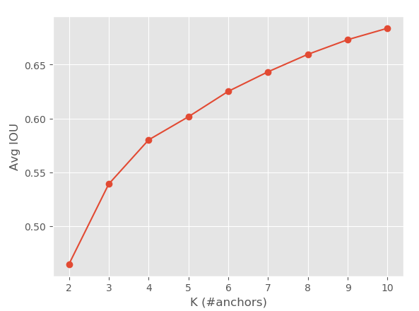

# Anchor-Kmeans
Implementation of kmeans clustering on bounding boxes to generate anchors, as mentioned in the [YOLOv2](https://arxiv.org/abs/1612.08242).

## Usage
Currently supports three types of annotation file: 
- [labelme json file](https://github.com/wkentaro/labelme)
- [VOC xml file](https://pjreddie.com/projects/pascal-voc-dataset-mirror/)
- csv file, each line is a coordinate values separated by a comma,  form as `xmin, ymin, xmax, ymax`

To generate anchors of your own dataset is very simple, just execute the `gen_anchors.py` script with 3 arguments:

```bash
python gen_anchors.py -d /path to your/annotations-dir -t [annotation file type, defualt 'xml'] -k [num of clusters, default 5]
```

## Test

I have tested it on the VOC2012 dataset, the trend of average iou with k value is shown in the figure below



See the detailed test code in [demo.ipynb](./demo.ipynb)

